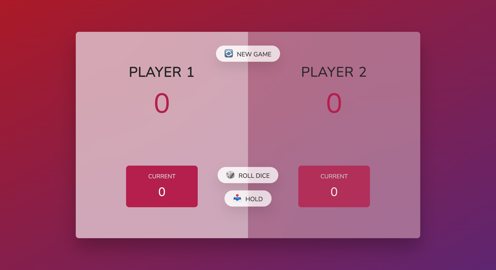

# Introduction

Live review: [Click here!](https://lynnhtetkyaw95.github.io/pig-game-dice-rolling-game/)

In this project, we are going to build the Pig Game (dice Rolling) that can be played with two players. The technologies we using are:

- HTML
- CSS
- JavaScript (**DOM Manipulation**)

## Instructions

Player rolls the dice with random dice number and the player who gets **100 points** first will win the game. Simple, right? It's really fun 😊.

In the game, we have 3 buttons:

- New: Players can restart the game
- Roll: Players roll the dice
- Hold: Players hold the current point and add to the total score

## Flowcharts

## Note

Change the playing state by using state variable (`let playing = true`).

Dynamically select the player and dice images by using template literal with `querySelector()`.

According to the **Don't repeat yourself** principle, use `function` for repetitive codes.

- `init()`
- `switchPlayer()`
